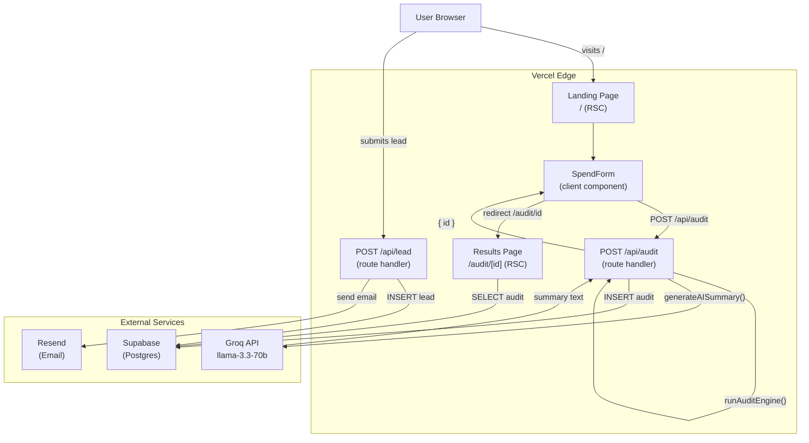
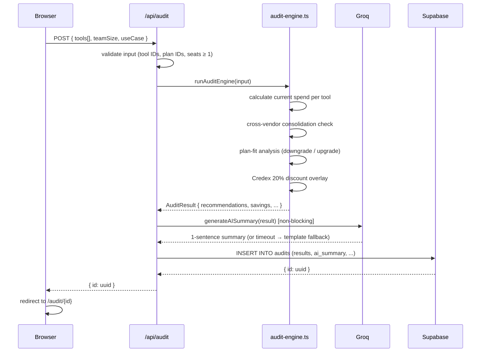

# Architecture

## Stack

| Layer | Technology | Why |
|-------|-----------|-----|
| Framework | Next.js 16 (App Router) | Full-stack in one repo; RSC for OG tags; API routes for backend |
| Language | TypeScript (strict) | Catch bugs at compile time; audit engine is pure functions |
| Styling | Tailwind CSS v4 + Base UI | Utility-first; v4 CSS-variable theming; Base UI for accessible primitives |
| Database | Supabase (Postgres) | Managed Postgres; Row Level Security for data isolation; free tier generous |
| AI | Groq `llama-3.3-70b-versatile` | Fast (<1s), cheap, free tier; summary is a nice-to-have not critical path |
| Email | Resend | Simple REST API; generous free tier; good deliverability |
| Testing | Vitest | Native TypeScript; fast; compatible with Next.js without extra config |
| Deploy | Vercel | Zero-config Next.js deploy; Edge network; free hobby tier |

---

## System Diagram



---

## Data Flow — Audit Submission



---

## Audit Engine Logic

```
for each tool entry:
  1. Cross-vendor consolidation
     - Group tools by category (chat / coding / api)
     - If multiple tools in same category:
         → mark secondary tool as "consolidate" (cancel = $0/mo)
         → primary = highest spend in category

  2. Plan-fit (only if not already consolidating)
     - If seats < plan.minSeats → look for cheaper valid plan
     - If seats > 3 on individual plan → check if team plan is same/cheaper
     - Apply recommendedAction: downgrade | upgrade

  3. Credex overlay
     - credexSavings = newMonthlyCost × 20%
     - If no plan change but credex > $5/mo → surface as "use_credex"
     - If tool being cancelled → credexSavings = 0

  4. Skip "keep_current" entries (no value to show)

aggregate:
  totalMonthlySavings = Σ (currentCost - newCost)
  totalCredexSavings  = Σ credexSavings
  totalAnnualSavings  = (plan savings + credex) × 12
```

---

## Component Architecture

```
RootLayout
├── Header (sticky, all pages)
├── page.tsx (Landing)
│   ├── Hero section
│   ├── VALUE_PROPS grid (3-col)
│   ├── HOW_IT_WORKS grid (3-col)
│   └── SpendForm
│       ├── TeamInfo (team size + use case)
│       └── ToolEntryRow[] (tool + plan + seats per row)
├── /audit/[id]/page.tsx (Results, server component)
│   ├── SavingsHero (count-up animation)
│   ├── ToolCard[] (per recommendation)
│   ├── AI analysis block
│   ├── CredexCTA
│   ├── ShareButtons
│   └── LeadCaptureForm
└── Footer (all pages)
```

---

## Scaling to 10,000 Audits / Day

At 10K audits/day (~7 audits/minute at peak):

### Bottlenecks and mitigations

| Bottleneck | Current | At scale |
|-----------|---------|---------|
| Audit computation | In-process, ~5ms | Still in-process; pure TS, no I/O |
| Groq API calls | 1 per audit | Rate limit: ~30 req/min on free tier → upgrade to paid or add queue |
| Supabase writes | 1 INSERT per audit | Supabase handles 10K writes/day trivially; connection pooling via pgBouncer |
| Supabase reads | 1 SELECT per results page view | Add Vercel Edge caching on `/audit/[id]` (immutable once written) |
| Cold starts | Next.js RSC cold start ~200ms | Vercel keeps functions warm; no issue at this scale |

### Concrete steps for 10K audits/day

1. **Cache results pages at the edge** — add `export const revalidate = 86400` to `/audit/[id]/page.tsx`. Each audit result is immutable once generated; no reason to re-fetch from Supabase on every view.

2. **Queue Groq calls** — replace inline `await generateAISummary()` with a background job (Vercel Queue or Inngest). The API returns the audit UUID immediately; the AI summary is populated asynchronously and the results page shows it once ready.

3. **Add Supabase connection pooling** — enable pgBouncer in Supabase dashboard (transaction mode). Prevents connection exhaustion under burst load.

4. **Index `audits.id`** — already a primary key (UUID), so lookups are O(1). No additional indexing needed.

5. **Rate-limit `/api/audit`** — add IP-based rate limiting (Upstash Redis + `@upstash/ratelimit`) to prevent abuse: 10 audits per IP per hour.
